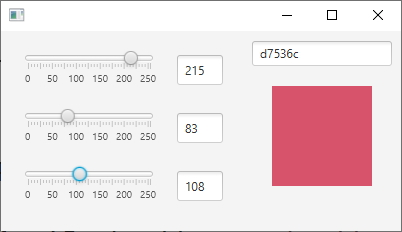

Programmation Java @ Et3 \
Polytech Paris-Saclay | 2024-25

___

# TP4

Le but de ce TP est de réaliser une interface de gestion de couleur.

Ce programme devra contenir :

  - un [*TextField*](https://openjfx.io/javadoc/21/javafx.controls/javafx/scene/control/TextField.html) et un [*Slider*](https://openjfx.io/javadoc/21/javafx.controls/javafx/scene/control/Slider.html) permettant la visualisation et la modification de la composante *Rouge* de la couleur.
  - un [*TextField*](https://openjfx.io/javadoc/21/javafx.controls/javafx/scene/control/TextField.html) et un [*Slider*](https://openjfx.io/javadoc/21/javafx.controls/javafx/scene/control/Slider.html) permettant la visualisation et la modification de la composante *Vert* de la couleur.
  - un [*TextField*](https://openjfx.io/javadoc/21/javafx.controls/javafx/scene/control/TextField.html) et un [*Slider*](https://openjfx.io/javadoc/21/javafx.controls/javafx/scene/control/Slider.html) permettant la visualisation et la modification de la composante *Bleu* de la couleur.
  - un [*TextField*](https://openjfx.io/javadoc/21/javafx.controls/javafx/scene/control/TextField.html) permettant la visualisation et la modification de la valeur de la couleur en base [hexadécimale](https://fr.wikipedia.org/wiki/Couleur_du_Web#Codage_informatique_des_couleurs).
  - un [*Pane*](https://openjfx.io/javadoc/21/javafx.graphics/javafx/scene/layout/Pane.html) qui permet de visualiser la couleur en changeant de background.

 
</img>
 

1. Clonez ce projet et configurez votre IDE de la même manière que le TP1, en suivant les instructions sur https://github.com/polytech-ihm-et3/HowToUseJavaFxWithIDE. Le dossier *src* contient le code minimal pour afficher une fenêtre vierge.

2. Créez une interface, la plus proche possible de la figure ci-dessus. **Vous DEVEZ réaliser cette interface manuellement**, sans passer par *SceneBuilder*.

3. Créez les classes dont vous avez besoin pour faire fonctionner le programme, en respectant un pattern [*Modèle - Vue - Controlleur*](https://baptiste-wicht.developpez.com/tutoriels/conception/mvc/). L'architecture pourra être simple (une ou plusieurs vue(s), un seul modèle, un seul contrôleur), mais la répartition des rôles devra être claire.

> Pour cette application, vous avez plusieurs possibilités :
> - Implémenter différents [évènements](https://openjfx.io/javadoc/21/javafx.base/javafx/event/Event.html) pour chaque couleur (*cf*. TP3).
> - Définir vos attributs, dans le modèle, comme des [propriétés](https://docs.oracle.com/javase/8/javafx/properties-binding-tutorial/binding.htm) et faire de vos vues des [*ChangeListeners*](https://openjfx.io/javadoc/21/javafx.base/javafx/beans/value/ChangeListener.html).
> - Utiliser des [*EventHandlers*](https://openjfx.io/javadoc/21/javafx.controls/javafx/scene/control/TextField.html#setOnAction(javafx.event.EventHandler)) (*cf*. TP1 et 2).

4. Liez les éléments les uns avec les autres pour faire fonctionner le programme.

> Si l'utilisateur manipule le [*Slider*](https://openjfx.io/javadoc/21/javafx.controls/javafx/scene/control/Slider.html) d'une composante (*Rouge*, *Bleu* ou *Vert*), le [*TextField*](https://openjfx.io/javadoc/21/javafx.controls/javafx/scene/control/TextField.html) correspondant doit se mettre à jour et vice-versa. Une telle action doit également mettre à jour le [*TextField*](https://openjfx.io/javadoc/21/javafx.controls/javafx/scene/control/TextField.html) correspondant à la valeur [hexadécimale](https://fr.wikipedia.org/wiki/Couleur_du_Web#Codage_informatique_des_couleurs) de la couleur ainsi que le [*Pane*](https://openjfx.io/javadoc/21/javafx.graphics/javafx/scene/layout/Pane.html) permettant sa visualisation.
> Si l'utilisateur modifie la valeur [hexadécimale](https://fr.wikipedia.org/wiki/Couleur_du_Web#Codage_informatique_des_couleurs) de la couleur, toutes les autres vues doivent se mettre à jour.

___

**BARÈME DU TP :**

- Interface [5 pts]
> L'interface ressemble à celle présentée. Les éléments graphiques utilisez sont choisis intelligemment.
- Fonctionnalités [5 pts]
> Les fonctionnalités énoncées dans le sujet sont implémentées et fonctionnent correctement.
- Modèle - Vue - Contrôleur [8 pts]
> Les classes créées sont clairement divisées en trois parties selon le pattern [Modèle - Vue - Contrôleur](https://baptiste-wicht.developpez.com/tutoriels/conception/mvc/).
- Lisibilité [2 pts]
> Le code est lisible, correctement indenté et commenté.

___

**RENDU DU TP :**

Le TP devra être rendu sous la forme d'une archive zippée (.ZIP) contenant les sources (*i.e.* le code du projet) de votre projet. Cette archive sera envoyée à l'adresse [*polytech.ihm.et3@gmail.com*](mailto:polytech.ihm.et3@gmail.com) avec le sujet "[TpNote#1] Prénom NOM NuméroGroupe".
